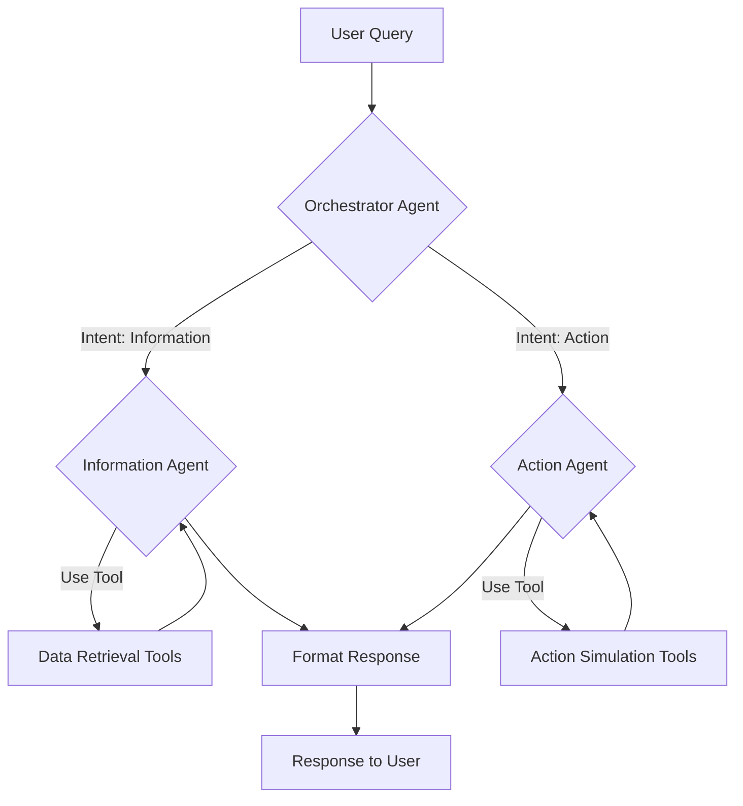

# Finance LangGraph Agent Plan

This document outlines the plan for creating a multi-agent LangGraph system for handling financial queries and actions based on mock data.

## 1. Proposed Architecture & Agent Roles

A LangGraph structure with multiple specialized agents:

- **Orchestrator Agent:**
  - **Input:** User query (e.g., "What's my balance?", "Cancel transaction XYZ").
  - **Role:** Analyzes the user's intent (information request vs. action request). Routes the task to the appropriate specialist agent. Manages the overall conversation state.
  - **Output:** Task delegated to either the Information Agent or Action Agent, along with necessary context.
- **Information Agent:**
  - **Input:** Specific information request (e.g., `get_balance`, `get_transactions`, `get_exchange_rate`) with parameters.
  - **Role:** Executes tools to retrieve data from the mock data files. Formats the information clearly for the user.
  - **Output:** Retrieved information (e.g., balance amount, list of transactions, exchange rate).
- **Action Agent:**
  - **Input:** Specific action request (e.g., `cancel_transaction`, `raise_dispute`) with parameters.
  - **Role:** Executes tools that simulate the requested action (logging/simulating changes to mock data). Confirms the action's (simulated) success or failure.
  - **Output:** Confirmation message (e.g., "Transaction XYZ has been marked for cancellation.", "Dispute raised for transaction ABC.").

## 2. Conceptual Tools (To be implemented in Code Mode)

These Python functions will interact with the mock data JSON files (`mock_data/dashboard_landing.json`, `mock_data/account_transactions.json`, `mock_data/exchange_rates.json`).

- **Data Retrieval Tools (for Information Agent):**
  - `read_mock_data(file_path)`: Helper to load JSON data from a file.
  - `get_dashboard_summary()`: Reads `dashboard_landing.json` and returns a summary.
  - `get_account_balance(account_no)`: Reads `dashboard_landing.json`, finds the account, and returns `AvailableBalance`.
  - `get_transaction_history(account_no, filters=None)`: Reads `account_transactions.json`, filters, and returns matching transactions.
  - `get_card_details(card_identifier)`: Reads `dashboard_landing.json`, finds the card, and returns details.
  - `get_exchange_rate(currency_code)`: Reads `exchange_rates.json` and returns the rate.
- **Action Simulation Tools (for Action Agent):**
  - `simulate_cancel_transaction(transaction_id)`: Finds transaction, logs/simulates cancellation. Returns success/failure.
  - `simulate_raise_dispute(transaction_id, reason)`: Finds transaction, logs/simulates dispute. Returns success/failure.

## 3. LangGraph Flow Diagram

