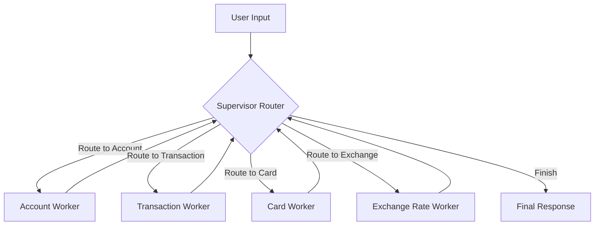
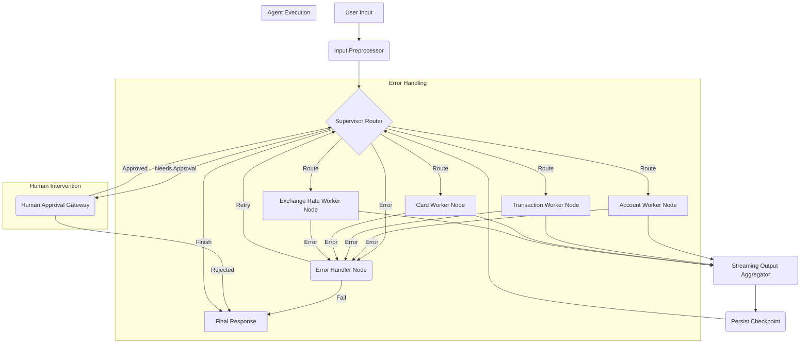

# Finance LangGraph Agent: Architecture Modernization Plan

## 1. Introduction

This document outlines the plan to modernize the `finance-langraph-agent` project by migrating its current LangGraph implementation to leverage the latest features and best practices. The goal is to enhance flexibility, maintainability, observability, and robustness by incorporating features like the Functional API, enhanced streaming, custom nodes, persistent checkpointing, and improved error handling.

## 2. Current Architecture Analysis

Based on the analysis of `src/graph/state.py` and `src/graph/builder.py`, the current architecture is characterized by:

- **Graph Type:** `langgraph.graph.StateGraph`
- **State Management:** A custom `FinancialAgentState` class inheriting from `MessagesState`, primarily tracking message history and the next agent to route to (`next: Optional[str]`).
- **Core Components:**
  - A central `supervisor` node responsible for routing tasks to specialized agents.
  - Multiple `worker` nodes, one for each specialized agent (`account_agent`, `transaction_agent`, `card_agent`, `exchange_rate_agent`), created dynamically using `create_worker_node_finance`.
- **Workflow:** A sequential flow where the `START` node goes to the `supervisor`, workers execute tasks and return to the `supervisor`, and the `supervisor` conditionally routes to the next worker or `END`.
- **Checkpointing:** Uses `langgraph.checkpoint.memory.InMemorySaver`, meaning state is not persisted across application restarts.

### Current Workflow Diagram

## 3. Identified Limitations

The current architecture, while functional, has several limitations compared to modern LangGraph capabilities:

1.  **No Streaming Support:** Lacks token-by-token LLM output streaming or intermediate step streaming, hindering real-time user feedback.
2.  **Basic Error Handling:** No built-in mechanisms for sophisticated error handling, retries, or fallbacks within the graph structure.
3.  **Limited Human Intervention:** No integrated support for human-in-the-loop validation or decision-making points.
4.  **Ephemeral State:** In-memory checkpointing means workflow state is lost on restart, preventing resumption of long-running tasks.
5.  **Rigid Structure:** `StateGraph` can be less flexible than the Functional API for complex, non-linear workflows or dynamic graph modifications.
6.  **Maintainability:** Routing logic is concentrated in the supervisor, which could become complex as more agents are added. Custom node implementations could offer better encapsulation.

## 4. Proposed Modernized Architecture

We propose migrating to LangGraph's Functional API and incorporating modern features:

- **Graph Type:** Utilize the Functional API for graph construction, offering greater flexibility.
- **State Management:** Enhance `FinancialAgentState` to include fields for streaming buffers, error context, and human intervention flags.
- **Core Components:**
  - **Preprocessor Node:** Handles initial input validation and formatting.
  - **Supervisor Router Node:** A custom node class for routing logic, potentially with fallback mechanisms.
  - **Specialized Agent Worker Nodes:** Custom node classes for each agent, encapsulating agent logic and tool calls. Potentially leverage `RunnableWithMessageHistory` for cleaner state management within agents.
  - **Human Approval Gateway Node:** A dedicated node to pause execution and await human input when required.
  - **Error Handler Node:** A custom node to catch, classify, and manage errors, potentially triggering retries or alternative paths.
  - **Streaming Output Node:** Aggregates results and handles streaming updates to the client.
- **Workflow:** More flexible routing, potentially allowing parallel execution, conditional branching based on errors, and explicit human intervention points.
- **Checkpointing:** Implement persistent checkpointing using a suitable backend (e.g., `PostgresSaver`, `SQLiteSaver`, or a custom saver) to allow workflow resumption.
- **Streaming:** Integrate both token-level and step-level streaming throughout the graph execution.

### Proposed Workflow Diagram

## 5. Migration Plan

The migration will be performed in phases:

**Phase 1: Core Architecture Upgrade**

1.  **State Enhancement:** Modify `FinancialAgentState` to include new fields (`streaming_buffer`, `error_context`, `human_intervention_required`, etc.).
2.  **Functional API Migration:** Rebuild the graph structure using the Functional API (`langgraph.graph.graph.Graph`). Define nodes as functions or `Runnable` instances.
3.  **Persistent Checkpointing:** Replace `InMemorySaver` with a persistent checkpointer (e.g., `SQLiteSaver` initially for simplicity, configurable for production). Ensure configuration allows resuming workflows.

**Phase 2: Node Modernization & Streaming**

1.  **Custom Node Implementation:** Refactor supervisor and worker logic into dedicated custom node classes or functions suitable for the Functional API.
2.  **Streaming Integration:** Implement streaming outputs from LLM calls within nodes and configure the graph to stream intermediate steps using `stream` or `astream_events`. Add the `StreamingOutput` aggregator node.

**Phase 3: Advanced Features & Stability**

1.  **Error Handling Node:** Implement the `ErrorHandlerNode` with logic for retries (e.g., using `RetryPolicy`) and error classification. Add error-handling edges from worker nodes and the supervisor.
2.  **Human-in-the-Loop:** Implement the `HumanApprovalGateway` node and add conditional edges from the supervisor to trigger human review based on specific criteria or confidence scores.
3.  **Testing & Refinement:** Add comprehensive unit and integration tests covering new features, error paths, streaming, and checkpoint resumption. Refine prompts and agent logic as needed.

## 6. Key LangGraph Features to Leverage

- **Functional API:** For flexible graph construction.
- **Enhanced Streaming (`stream`, `astream_events`):** For token-level and intermediate step updates.
- **Custom Nodes:** For better code organization and encapsulation of logic.
- **Persistent Checkpointers (`SQLiteSaver`, `PostgresSaver`, etc.):** For workflow resumption.
- **Human-in-the-Loop Mechanisms:** For incorporating human oversight.
- **Built-in Error Handling/Retry Mechanisms:** (If applicable within Runnables or via custom node logic).
- **`RunnableWithMessageHistory`:** Potentially simplify state management within agent nodes.

## 7. Risk Mitigation

- **Phased Rollout:** Implement changes incrementally, potentially maintaining the old graph structure initially for comparison.
- **Feature Flags:** Use feature flags to enable/disable new features during the transition.
- **Comprehensive Testing:** Develop thorough tests covering core functionality, edge cases, error handling, streaming, and checkpointing.
- **Backward Compatibility:** Ensure state schema changes are handled gracefully if migrating existing checkpoints is required (though likely starting fresh with persistent checkpoints).

## 8. Next Steps

With the plan approved, the next logical step is to begin implementation. This involves modifying the Python code according to the migration plan.
