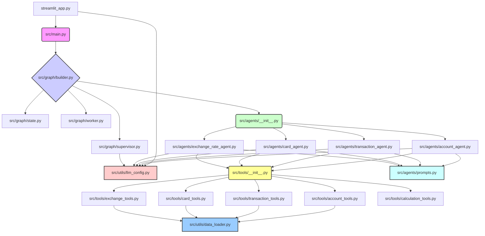

# Refactoring Plan: Improve Modularity

This plan outlines the steps to refactor the `banking_agent.py` file into a more modular structure to improve maintainability and readability.

**Goals:**

- Break down the single `banking_agent.py` file into logical components.
- Organize components into a clear directory structure under `src/`.
- Improve code organization and separation of concerns.

**Steps:**

1.  **Create New Directories:**

    - `src/`: Main source directory.
    - `src/tools/`: For tool definitions.
    - `src/agents/`: For agent definitions and prompts.
    - `src/graph/`: For graph definition, state, supervisor, and worker logic.
    - `src/utils/`: For helper functions (data loading, LLM config).

2.  **Move Code:**

    - **Tools:** Move `@tool` definitions and `PythonREPL` setup into `src/tools/` (e.g., `account_tools.py`, `calculation_tools.py`, etc.). Create `src/tools/__init__.py`.
    - **Mock Data Loading:** Move `load_mock_data` and initial loading into `src/utils/data_loader.py`.
    - **LLM Configuration:** Move LLM instantiation into `src/utils/llm_config.py`.
    - **Agent State:** Move `FinancialAgentState` into `src/graph/state.py`.
    - **Supervisor Logic:** Move `create_supervisor_finance` into `src/graph/supervisor.py`.
    - **Worker Node Logic:** Move `create_worker_node_finance` into `src/graph/worker.py`.
    - **Agent System Prompt:** Move `finance_agent_system_prompt` into `src/agents/prompts.py`.
    - **Agent Definitions:** Move `create_react_agent` calls into separate files in `src/agents/` (e.g., `account_agent.py`). Create `src/agents/__init__.py`.
    - **Graph Building:** Move graph node definitions and compilation into `src/graph/builder.py`.
    - **Main Execution Logic:** Move `run_finance_query` into a new `src/main.py`. Delete `banking_agent.py`.

3.  **Update Imports:** Modify all `import` statements in new files and `streamlit_app.py` to reflect the new structure (e.g., `from src.tools.account_tools import get_account_summary`).

4.  **Update `streamlit_app.py`:** Change imports to `from src.main import run_finance_query` and `from src.utils.llm_config import OPENAI_API_KEY`.

**Proposed File Structure:**

```
.
├── .env
├── .gitignore
├── mock_data/
│   ├── account_transactions.json
│   ├── dashboard_landing.json
│   └── exchange_rates.json
├── requirements.txt
├── streamlit_app.py
├── src/
│   ├── __init__.py
│   ├── main.py
│   ├── agents/
│   │   ├── __init__.py
│   │   ├── account_agent.py
│   │   ├── card_agent.py
│   │   ├── exchange_rate_agent.py
│   │   ├── transaction_agent.py
│   │   └── prompts.py
│   ├── graph/
│   │   ├── __init__.py
│   │   ├── builder.py
│   │   ├── state.py
│   │   ├── supervisor.py
│   │   └── worker.py
│   ├── tools/
│   │   ├── __init__.py
│   │   ├── account_tools.py
│   │   ├── calculation_tools.py
│   │   ├── card_tools.py
│   │   ├── exchange_tools.py
│   │   └── transaction_tools.py
│   └── utils/
│       ├── __init__.py
│       ├── data_loader.py
│       └── llm_config.py
└── PLAN.md
```

**Mermaid Diagram (High-Level Structure):**


