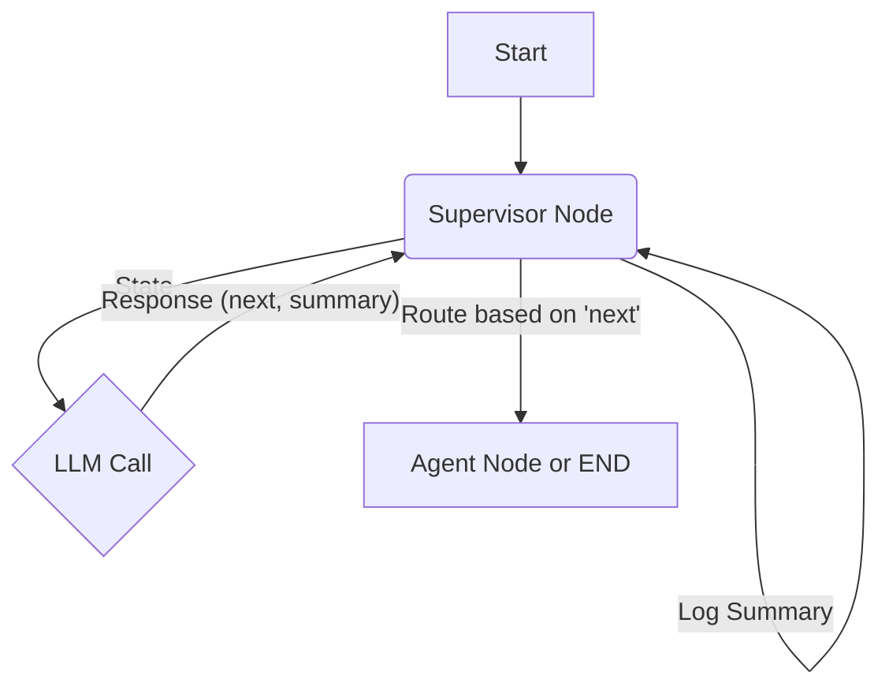

# Plan to Modify Supervisor for State Summary

**Objective:** Update the supervisor node in `src/graph/supervisor.py` to include a brief summary of the current state or reasoning before routing to the next agent or finishing.

**Steps:**

1.  **Modify the `Router` Pydantic Model:**

    - Add a new string field named `summary` to the `Router` model (defined around line 53). This field will store the summary provided by the LLM.

2.  **Update the `system_prompt`:**

    - Revise the system prompt (lines 32-50), specifically the "Output Format" section (line 49).
    - Instruct the LLM to output _both_ the `next` agent name (or 'FINISH') _and_ a brief `summary` explaining the state or routing decision, conforming to the updated `Router` model.

3.  **Update the `supervisor_node` Function:**
    - In the `supervisor_node` function (lines 61-96):
      - Extract both the `next` worker and the new `summary` field from the LLM's structured response (after line 71).
      - Add an `logger.info` statement to log the extracted `summary` before the existing routing decision log (around line 86).
      - Keep the existing routing logic based on the `next` worker value.

**Conceptual Flow Diagram:**

