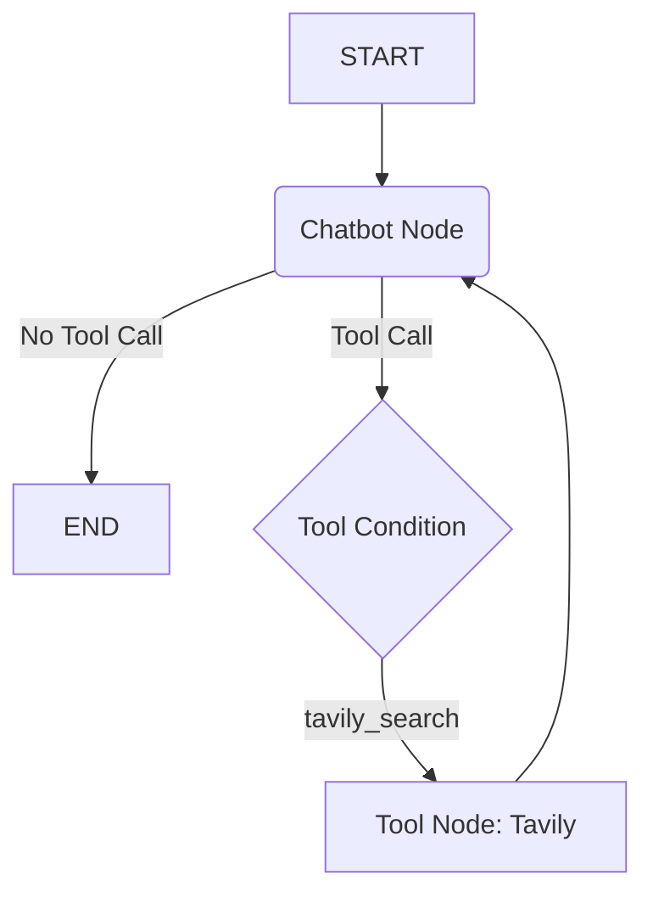

# Revised Learning Plan: Building a LangGraph Agent

This plan outlines the steps to learn LangGraph by building a chatbot agent, based on the official "Learn the basics" tutorial, but skipping the Human-in-the-loop section.

1.  **Setup:** Install necessary Python libraries (`langgraph`, `langchain_anthropic`, `langsmith`, `tavily-python`, `langchain_community`) and configure API keys (Anthropic, Tavily). Optionally set up LangSmith.

2.  **Part 1: Build a Basic Chatbot:**

    - **Concept:** Understand `StateGraph`, nodes, edges, and basic state (`messages` using `TypedDict`, `Annotated`, `add_messages`).
    - **Code:** Implement a simple chatbot node, define graph structure (`START`, `END`), compile, and run.

3.  **Part 2: Enhancing with Tools:**

    - **Concept:** Equip the agent with tools (`TavilySearchResults`) and implement conditional routing.
    - **Code:** Bind tools to the LLM, add a `ToolNode`, use `add_conditional_edges` with `tools_condition`.

4.  **Part 3: Adding Memory (Persistence):**

    - **Concept:** Use checkpointing (`MemorySaver`) for state persistence across turns.
    - **Code:** Compile the graph with a checkpointer, interact using `config` with `thread_id`, demonstrate separate histories, inspect state with `graph.get_state()`.

5.  **Part 5: Customizing State:**

    - **Concept:** Extend the state beyond `messages` (e.g., `name`, `data_found`) and update state programmatically.
    - **Code:** Modify `State` definition, potentially have a node update these custom fields after a tool call.

6.  **Part 6: Time Travel:**

    - **Concept:** Revisit and resume from past states using checkpoint history.
    - **Code:** Run the agent, use `graph.get_state_history()`, select a past checkpoint `config`, and resume execution from that point.

7.  **Part 7: Checking (Optional):**
    - **Concept:** Use LangGraph's development server for local testing.
    - **Action:** Briefly explore the `langgraph dev` command.

## Revised Workflow Diagram (Simplified)

